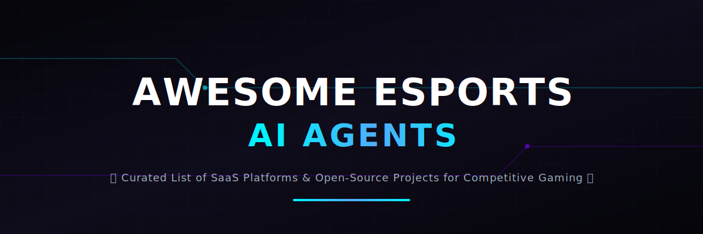

# Awesome-eSports-AI-Agents

  

  
  
  
  

---

## 🎮 Top eSports Building AI Agents Ecosystem 🚀

**Curated List of SaaS Products & Open-Source GitHub Projects**  
*Focused on AI Agents for Gaming Performance, Analytics, Coaching, & eSports Operations*  
**Last updated: March 2026**

This repository tracks notable **SaaS platforms** and **open-source projects** building **eSports AI Agents**. These intelligent agents analyze gameplay, provide performance insights, recommend strategies, automate coaching, manage teams, and enhance spectator experiences in competitive gaming.

**Examples** include GRID AI Insights, Team Liquid’s Joule, Aimlabs, DeepMotion, Promethean AI, Opus Clip, Hedra, Digiqt Community Agent, Theta Technolabs Analytics Agent, and Fini AI (the category leaders). Tools listed here emphasize **real-time analysis**, player improvement, team coordination, and content generation for eSports.

**Open-source emphasis**: This section is heavily expanded with every major active project for self-hosting, local LLMs (Ollama), full customization, and community-driven development — ideal for eSports organizations, coaches, and indie game developers who want sovereign AI tools.

Contributions welcome! Open a PR to add/update entries. Keep descriptions factual and link to official sites.

## Table of Contents
- [SaaS Products](#saas-products)
- [Open-Source GitHub Projects](#open-source-github-projects)
- [How to Contribute](#how-to-contribute)
- [Disclaimer](#disclaimer)

## SaaS Products

### Core Platforms (eSports AI Agents)

| SaaS Product | Description | Pricing Model | Free Tier Limit | Company Size (Est. Valuation / Revenue) |
| :--- | :--- | :--- | :--- | :--- |
| **[Team Liquid’s Joule](https://teamliquid.com/)** | Custom AI agent developed by Team Liquid for strategy, scouting, and performance optimization. | Custom / Proprietary (Enterprise integration with SAP Joule) | No free tier (Internal proprietary tool). | ~$415M Valuation / $62.4M Revenue |
| **[Opus Clip](https://opus.pro/)** | AI video editing agent specialized in creating highlight reels and social content from eSports matches. | Freemium (Paid plans from $15/mo) | 60 credits/mo, includes watermark, clips must be exported within 3 days. | ~$215M Valuation |
| **[Hedra](https://hedra.com/)** | AI character and animation platform for creating engaging eSports content and avatars. | Freemium (Paid plans from $15/mo) | ~100–400 credits/mo, includes watermark, personal non-commercial use only. | ~$200M Valuation / $3.5M ARR |
| **[Aimlabs](https://aimlabs.com/)** | AI-driven aim trainer with personalized coaching and performance tracking. | Free / Premium (Aimlabs+ at $9.99/mo) | Unlimited (Core trainer, custom tasks, and community scenarios are free). | ~$150M Valuation (Raised $50M Series C) |
| **[GRID AI Insights](https://grid.gg/)** | AI-powered analytics platform delivering deep performance insights for competitive gaming. | Custom / Enterprise | No standard free tier (Open Access available for select non-commercial research projects). | ~$24.4M Valuation / $7.6M Revenue |
| **[Fini AI](https://fini.ai/)** | AI coaching and performance optimization agent for individual players and teams. | Custom / Enterprise (Resolution-based pricing, e.g., $0.69/resolution) | No standard free tier (90-day risk-free trial/pilot programs available). | ~$6.8M Valuation / $2.3M ARR |
| **[Promethean AI](https://promethean.ai/)** | Intelligent AI assistant for game development and eSports content creation. | Free for Personal / Custom (Commercial licensing) | Free for personal, non-commercial use. | ~$5M Valuation (Est. Private) |
| **[DeepMotion](https://www.deepmotion.com/)** | AI motion capture and animation platform used for realistic player movement analysis in eSports. | Freemium (Paid plans from $9/mo billed annually) | 3 credits/mo, 1 download/mo, up to 10-second clip length. | ~$4.3M Valuation / $1.4M ARR |
| **[Digiqt Community Agent](https://digiqt.com/)** | AI agent for community management and fan engagement in eSports organizations. | Custom / Project-based | No free tier (Free 15-minute consultation available). | ~$3.0M Valuation (Est. Revenue ₹3.94 Cr) |
| **[Theta Technolabs Analytics Agent](https://thetatechnolabs.com/)** | Specialized AI for performance analytics and strategic decision support. | Custom / Project-based | No free tier (Requires custom integration consultation). | ~$1.0M Valuation (Est. Revenue ~$134K) |

## Open-Source GitHub Projects

### Dedicated eSports & Gaming AI Agents

- **[Godot Engine AI Agents](https://github.com/godotengine/godot)**   
  Open-source game engine with excellent support for building AI agents and analytics tools.

- **[OpenCV + Computer Vision for Gaming](https://github.com/opencv/opencv)**   
  Computer vision library widely used for gameplay analysis, highlight detection, and performance metrics.

- **[n8n Gaming Workflows](https://github.com/n8n-io/n8n)**   
  Open-source workflow automation for building custom eSports data pipelines and AI agents.

- **[CrewAI Gaming Crews](https://github.com/crewAIInc/crewAI)**   
  Role-based multi-agent orchestration for creating analyst, coach, and commentator agents.

- **[Huginn eSports Agents](https://github.com/huginn/huginn)**   
  Open-source automation agent for monitoring tournaments, player stats, and triggering insights.

- **[RLlib (Ray)](https://github.com/ray-project/ray)**   
  Scalable reinforcement learning library for complex game AI.

- **[Phidata Gaming Agents](https://github.com/phidatahq/phidata)**   
  Framework for building production agents with memory and tools for eSports analytics.

- **[LangGraph eSports Agents](https://github.com/langchain-ai/langgraph)**   
  Stateful multi-agent framework for building strategy, scouting, and coaching agents.

- **[Stable Baselines3](https://github.com/DLR-RM/stable-baselines3)**   
  Reliable RL library for training AI agents to play and analyze competitive games.

- **[Unity ML-Agents](https://github.com/Unity-Technologies/ml-agents)**   
  Powerful toolkit for training intelligent agents in Unity games.

- **[OpenAI Gym / Gymnasium](https://github.com/Farama-Foundation/Gymnasium)**   
  Foundation for reinforcement learning agents in gaming environments with strong eSports applications.

- **[OpenSpiel](https://github.com/deepmind/open_spiel)**   
  Collection of environments and algorithms for game AI research.

- **[Aim Trainer Open-Source](https://github.com/search?q=aim+trainer+open+source)**  
  Multiple community projects for building custom AI-powered aim training tools with performance analytics.

- **[Chess / Fighting Game AI]** community repositories adaptable to eSports.
- Many **Ollama + Computer Vision** stacks for local gameplay analysis agents.

**Frameworks for building custom agents**: Combine **LangGraph**, **CrewAI**, **Godot**, and **OpenCV** with **Ollama** to create fully local, powerful eSports AI agents for training, analytics, and content creation.

## How to Contribute

1. Fork the repo.
2. Add/edit entries in `README.md` (follow existing format).
3. Include: name, link, 1–2 sentence description, and whether it's SaaS or open-source.
4. Submit PR with a short explanation.

Star the repo if you find it useful!

## Disclaimer

- This is a **community-curated** list — not exhaustive and not an endorsement.
- AI agents in competitive gaming should be used ethically and in compliance with game terms of service.
- Self-hosted open-source solutions require proper hardware and maintenance.

---

**Made for eSports teams, coaches, analysts, content creators, and game developers.**  
Let's make competitive gaming smarter, more insightful, and fully controllable.